<h3><code>vishnu@github ~ $ ./contributions.sh</code></h3>

  

<h3><code>vishnu@github ~ $ whoami</code></h3>
<table>
  <tr>
    <td valign="top"></td>
    <td valign="top"></td>
  </tr>
</table>

 

<h3><code>vishnu@github ~ $ ls ~/projects --featured</code></h3>
<table>
  <tr>
    <td valign="top"></td>
    <td valign="top"></td>
  </tr>
  <tr>
    <td valign="top"></td>
    <td valign="top"></td>
  </tr>
</table>

<code>$ ls ~/projects --all</code> &nbsp;(more projects)

 

- **[Age &amp; Emotion Detection](https://github.com/vishnumuthyalu/AgeEmotionDetection)** · CNN-based facial recognition, age and emotion prediction (TensorFlow, Keras)
- **[Gearbox Supply](https://github.com/vishnumuthyalu/errorlist-autoparts-website)** · Auto-parts e-commerce site with vehicle-specific recommendations (React, Firebase)
- **[MyRunBuddy](https://github.com/vishnumuthyalu/MyRunBuddyApplication)** · Android run tracker with an AI coaching chatbot (Kotlin, SQLite, Gemini)
- **[Car Dealership Database](https://github.com/vishnumuthyalu/Car-Dealership-Database)** · Normalized MySQL schema with triggers, procedures and audit logging

 

<h3><code>vishnu@github ~ $ contact --all</code></h3>

